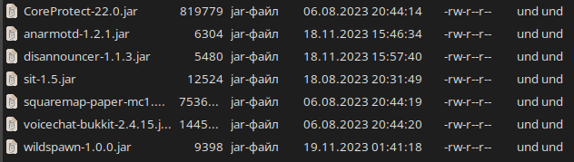
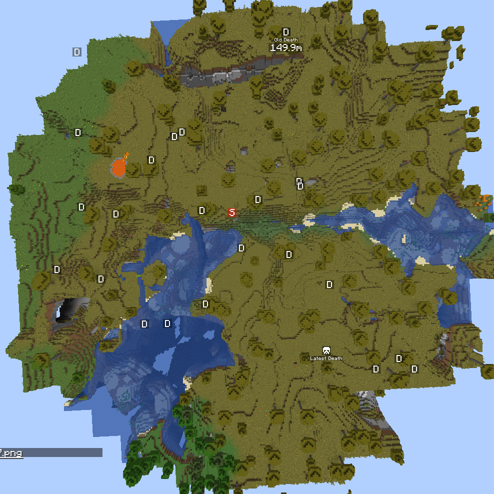

Since 2018 I played with people on a single (actually two, but the second one was made to keep playing without politically charged harassment against me) Minecraft SMP (survival multiplayer) server and generally did not bother searching or playing anywhere else. What's the reason for that? This SMP didn't have a game-breaking mod or a plugin installed, didn't have any time constraints, didn't have any lore.  

## Keep things simple
Around 2021, a lot of Minecraft-related content on major media platforms (YouTube, Twitch, etc) spun around an idea of a multiplayer server: people get together, have fun and make content on the way.  

Most of these SMPs have at least one quirk to them: DreamSMP has (or had) some lore, Lifesteal had a mod/plugin to outright ban people when they die too much, something like Origins SMP has (or had) a mod that changes players stats whilst keeping them balanced.  

One might say that all those _quirks_ make the base game _less boring_ and more entertaining to watch. I can't disagree with this but I can't agree either. And the reason for this is one simple question: **is the base game really boring?**

And the answer is: _absolutely f*cking not!_ The base game is NOT boring! People just seem to blaze through it like they are speedrunning and not stop to enjoy all the little things around; this mindset makes new servers and singleplayer worlds to be played for like two days and then just get abandoned. I've seen YouTube videos popping up recently that state exactly that. I am not alone.  

So the best SMP is the SMP that just _doesn't have_ any mods or game-breaking plugins but limits players evolving too quickly. How could this be achieved without using any mods? Hard difficulty. Players will learn how to play the game from scratch exactly like I did back in 2018. It's a great experience.

Keeping things simple also involves using as less plugins as possible. Here's all the plugins I use at the time of this article writing:  



## Survival first, Multiplayer second
Another way to prevent fast development is to adjust the gameplay in such a way that players rarely feel that the game is actually a multiplayer: every player would start on their own, build their own home, tame their own pets, etc; and only _occasionally_ meet other players.  

How could this be achieved then? There's a couple of steps:  

1. Setting up the server core to work as close to Vanilla Minecraft as possible. My SMP uses [Paper](https://papermc.io/), so there was plenty of documentation on how to set it up to work as close to vanilla as possible. At least now the server allows breaking bedrock, duping TNT entities and a lot of other technical things that are a thing in Vanilla.  

    Just, y'know, don't forget about [optimizing](https://paper-chan.moe/paper-optimization/) things while you're setting up the server's configuration.  

2. Setting every player's worldspawn point to a big random value. Just setting `spawnRadius` to a big value isn't going to cut it because player can respawn _VERY FAR AWAY_ from their initial spawn point. So I made a [plugin](https://modrinth.com/plugin/wildspawn) to do exactly that, and it nicely integrates with Vanilla.  

    Have an example, the spawn point (in red) is very far away from the world's geographic center and all the respawn points (in black) are spread around it:  

  

## Keep moderation at minimum
Setting up an awfully big set of rules or inducing a dictatorship of a moderation team is not how players should feel whilst playing a survival game. But server management still should be a thing, and people that act hostile towards everyone are to be punished.  

Though it may look like an anarchy, it is not. Griefing and any vandalizing isn't allowed (again with reasons rooting at "Survival first" clause). But how can players report people who vandalized their property then? Here's a couple of points:  

1. The server should have a logging plugin of sorts installed. For example, my server uses a quite popular nowadays [CoreProtect](https://github.com/PlayPro/CoreProtect).  

2. Commands to _inspect_ and _lookup_ data for a specific block position, player, range or a time frame are exposed to all players without exceptions. This allows players to either keep track of who was at their base and what items did they take, or to report vandals to management. For example, that's how my SMP's `permissions.yml` file looks like:  

```yaml
coreprotect.lookup:
    default: true
    children:
        coreprotect.lookup.block:       true
        coreprotect.lookup.chat:        true
        coreprotect.lookup.click:       true
        coreprotect.lookup.command:     true
        coreprotect.lookup.container:   true
        coreprotect.lookup.inventory:   true
        coreprotect.lookup.kill:        true
        coreprotect.lookup.near:        true
        coreprotect.lookup.session:     true
        coreprotect.lookup.sign:        true
        coreprotect.lookup.username:    true
coreprotect.inspect:
    default: true
```

3. Considering chat reporting being a debatable thing, I'd disable them altogether, but I respect personal choice; on my SMP I just allowed players to opt out from it by setting `enforce-secure-profile` to `false` in `server.properties`.

## Freedom of modding
Allowing players to install any client-side mods and resourcepacks as long as they do not give them unfair advantage is a must-have clause.  

One notable exception to that is mods that add a waypoint system and/or a minimap: these are allowed, and on top of that installing one is encouraged simply because when things are spread far apart in the world, it becomes hard to keep track of your friends locations!  

I personally use a minimap mod with the minimap disabled, it clutters the UI and I just feel like it's slightly unfair to see caves and players just like that.

## Conclusion
Let's reiterate what makes a Minecraft SMP great for me:  

1. Have as less plugins installed as possible, and plugins installed must not steer the gameplay from Vanilla.  

2. Server config set up in such a way that it behaves as close to Vanilla as possible without impeding performance.  

3. Limit players development speed by spreading them out, making their gameplay progressively look and feel like singleplayer, just with some multiplayer additions.  

4. Keeping moderation at minumum, giving the task of finding rule breakers to the players themselves by giving them access to a limited set of management commands.  

5. Unless interfering with points above, the classic no-hacks rule or certain real-life laws, give players absolute freedom to play and modify the game.  
